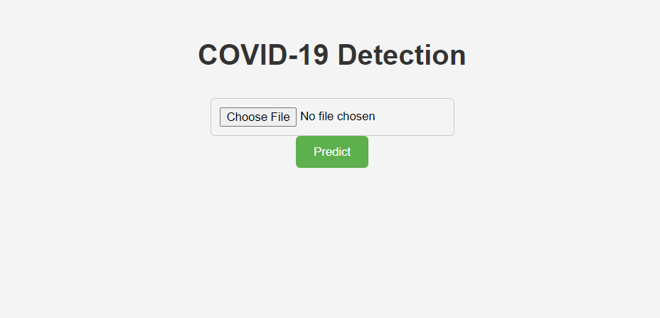
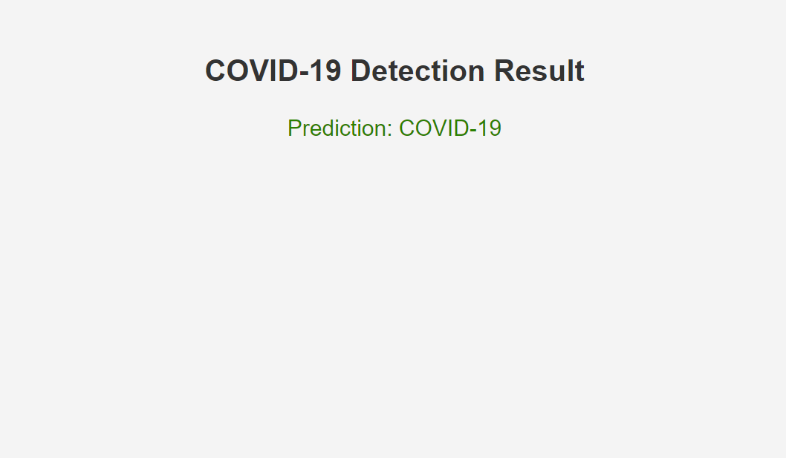

# Covid-Detection-model-using-Chest-X-ray

## Problem Statement
Corona - COVID19 virus affects healthy people's respiratory systems, and chest X-Ray is one of the most significant imaging modalities for detecting the virus.

The objective of this project is to develop a Deep Learning Model to identify the X-Rays of healthy vs. Pneumonia (Corona) afflicted patients using the Chest X-Ray dataset which can be used to power AI applications to test the Corona Virus at a faster phase.

## Dataset Used
The dataset is a collection of Chest X-Ray images of people. It contains images of people who are healthy, those who are tested positive for COVID-19 or other viral and bacterial pneumonias such as SARS (Severe Acute Respiratory Syndrome), Streptococcus, and ARDS (Acute Respiratory Distress Syndrome).

**Dataset Link:** [Kaggle - Coronahack Chest X-ray Dataset](https://www.kaggle.com/praveengovi/coronahack-chest-xraydataset)

There are 2 files present. One of them is the data and the other is the metadata. A sample of the data file is shown in Figure 1 and a sample of the metadata is shown in Figure 2.

**Figure 1. Data file sample**

|   | Unnamed:0 | X_ray_image_name | Label  | Dataset_type | Label_2_Virus_category | Label_1_Virus_category |
|---|-----------|------------------|--------|--------------|------------------------|------------------------|
| 0 | 0         | IM-0128-0001.jpeg| Normal | TRAIN        | NaN                    | NaN                    |
| 1 | 1         | IM-0127-0001.jpeg| Normal | TRAIN        | NaN                    | NaN                    |
| 2 | 2         | IM-0125-0001.jpeg| Normal | TRAIN        | NaN                    | NaN                    |
| 3 | 3         | IM-0122-0001.jpeg| Normal | TRAIN        | NaN                    | NaN                    |

**Figure 2. Metadata file sample**

| Unnamed: 0 | Label     | Label_1_Virus_category | Label_2_Virus_category | Image_Count |
|------------|-----------|------------------------|------------------------|-------------|
| 0          | Normal    | NaN                    | NaN                    | 1576        |
| 1          | Pneumonia | Stress-Smoking         | ARDS                   | 2           |
| 2          | Pneumonia | Virus                  | NaN                    | 1493        |
| 3          | Pneumonia | Virus                  | COVID-19               | 58          |

## Data Cleaning and Preparation

* Separate the train and test images by filtering using the labels.
* Fill all NaN (Not a Number) values with ‘NA’ string and append ‘Label_2_Virus_category’ column with the ‘Label’ column.
* Ensure all label types like ‘Normal/NA’, ‘Pneumonia/NA’ and ‘Pneumonia/COVID-19’ are present in both train and test sets.
* Perform image data augmentation on the train set to produce and add more images with varied orientations and properties like zoom and brightness to improve the model's accuracy.

## Algorithm Used
As we have to classify the data into 3 categories of outputs ‘Normal/NA’, ‘Pneumonia/NA’ and ‘Pneumonia/COVID-19’, we have chosen CNN (Convolutional Neural Network).

### Model Architecture
The input shape is (256,256,3) with various Convolutional layers with different numbers of filters and padding set to ‘same’. Padding set to ‘same’ ensures the image dimensions remain unchanged after every convolutional layer, allowing the model to learn features along the edges of the image.

We used L2 regularization with a value of 1e-4 to control excessively fluctuating functions. The activation function is ReLU, and we also applied ‘Batch Normalization’ after every convolutional layer to prevent overfitting and reduce the number of epochs required to train the model.

In the prefinal layer, we flatten the image into a feature vector and feed it to a Dense layer with 3 outputs corresponding to the classes ‘Normal/NA’, ‘Pneumonia/NA’, and ‘Pneumonia/COVID-19’, using the ‘softmax’ activation function to assign probabilities to each class.

**Optimization:**
- Optimizer: Adam with a 0.0004 learning rate
- Loss function: Categorical cross-entropy

The model was trained for 40 epochs with 3740/32 steps per epoch, yielding a training accuracy of 94.76% and a validation accuracy of 77.54%. After adjusting the learning rate to 0.0002 and training for 2 more epochs, the training accuracy improved to 95.28% and validation accuracy to 89.52%.

### Training Accuracy and Validation Accuracy (Figure 4)

### Training Loss and Validation Loss (Figure 5)

## Deployment and User Interface
The project is deployed using Flask, enabling users to upload their chest X-ray images for the model to determine if they have COVID-19 or not.

### Application Screenshots

**Screenshot 1: Upload Page**

**Screenshot 2: Result Page**

By integrating this model into a user-friendly web application, individuals can conveniently assess their COVID-19 status based on chest X-ray images, contributing to the rapid identification and management of the virus.

## Software Packages Used
* Numpy 1.21.1
* Pandas v1.3.1
* Matplotlib 3.3.4
* TensorFlow 2.0
* Keras 2.3.0
* Flask 2.2.2

## Industrial Scope and Advantage of This Project
Methods for detecting and classifying human illnesses from medical images using novel Machine Learning and Deep Learning Algorithms enable doctors to drive consultations more effectively, reducing the time it takes to diagnose the Coronavirus. This gives physicians an edge and allows them to act with more confidence while they wait for the radiologist's analysis. Additionally, these tools can provide quantitative scores to consider and use in studies.
